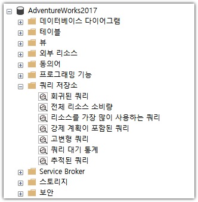
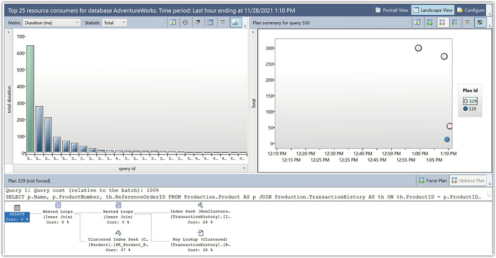
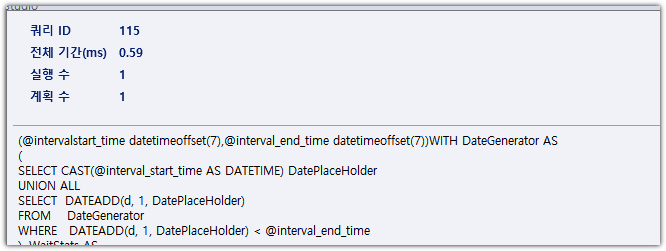
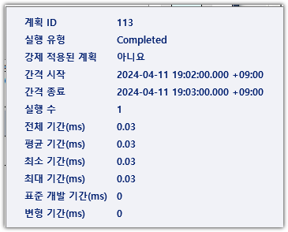
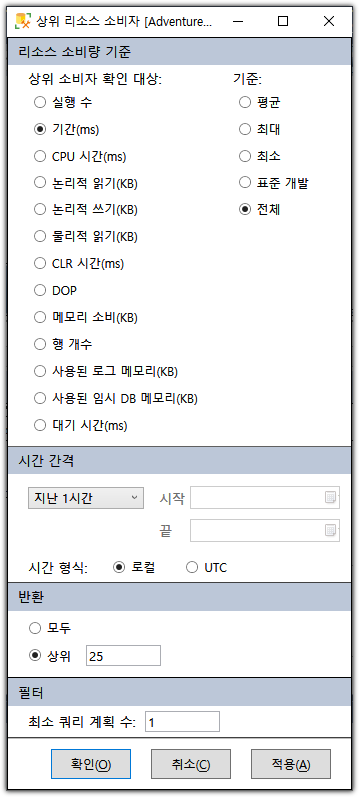
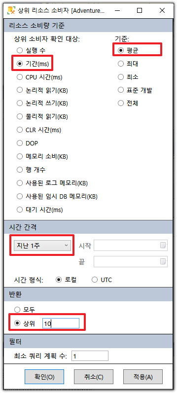
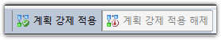
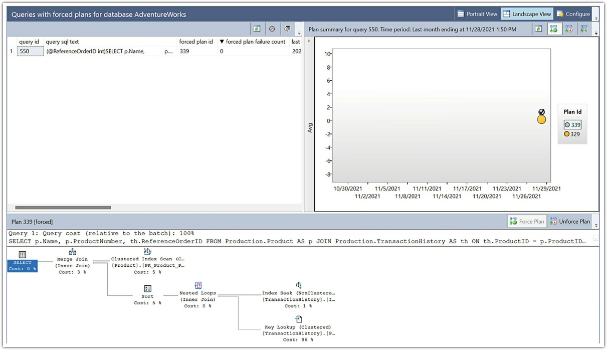

# 쿼리 저장소 New

쿼리 저장소는 Sql Server와 Azure Sql Database에서 쿼리튜닝을 도와주는 다수의 기능을 추가했다

    * 첫째로 이 기능을 활성화시킨 데이터베이스에서 성능 수치를 캡처하고 수치의 히스토리를 보게 해주고  
    * 두번째로는 실행계획을 캡처함으로써 실행계획과 실행행동이 시간에 따라 어떻게 변화하는지 볼수있다. 
        그리고 실행계획 강제(용어확인)와 쿼리힌트와 같은 방법을 통해서 실행계획을 조율할수 있게 한다.
    
이런것들로 인하여 쿼리스토어를 쿼리 튜닝할 때 매우 강력한 도구로 만들준다.

이번 장에서 다음 주제를 다룬다.
    
    * 쿼리스토어가 작동하는 방법과 수집하는 정보들
    * SSMS에서 쿼리스토어의 보고기능과 메카니즘
    * 실행계획 강제(Sql Server이 특정 계획을 사용하도록 강제하는 방법)
    * 쿼리 저장소를 통하여 쿼리힌트 사용(기존 쿼리 수정없이 힌트만 지정)
    * 시스템 성능을 보호할때 도움을 주는 업그레이드 방법


## <font color='dodgerblue' size="6">6.1 쿼리저장소 기능과 디자인</font>

쿼리저장소에는 다양한 기능이 있다. 하지만 핵심은 해당 데이터베이스에서 실행되는 쿼리들의 집계정보를 수집한다는 것이다. 이런 정보들에 덧붙여 실행계획을 수집한다. 쿼리저장소는 Azure SQL Database에는 기본으로 활성화되어 있지만 Sql Server에는 데이터베이스 단위에서 활성화시켜야 한다.

```sql
    ALTER DATABASE AdventureWorks SET QUERY_STORE = ON;
```    
리스트6-1 sql로 쿼리저장소 활성화 시키기

또는 SSMS에서 데이터베이스를 선택하고 오른마우스 / 속성 / 쿼리 저장소에서 설정한다. 더 자세한 내용은 아래에서 좀더 설명 예정.
    
쿼리저장소가 활성화되면 아래그림처럼 활동이 된다.

  
그림 6-1

쿼리 최적화는 쿼리저장소에의해 바로 영향을 받지 않는다. 쿼리가 시스템에 제출될때 2장에서 설명한것처럼 실행계획이 만들어진다. 보통은 계획이 플랜캐시에 저장되고(7장에서 좀더 자세하게 설명 예정) 계획강제화는 행동을 변화시킨다. 계획강제화가 표준작동방식을 어떻게 변경하는지 이번장의 뒤부분에서 자세히 설명할것이다. 어떤 강제된 계획이 없는 경우 계히ㅗㄱ이 플랜캐시에 저장된 후에 비동기 프로세스가 임시 저장공간을 위한 분리된 메모리 영역에 계획을 복사한다. 그러면 또다른 비동기 프로세스는 데이터베이스 시스템 테이블안에 있는 쿼리저장소에 플랜을 쓴다. 이런 비동기 프로세스들은 가능한 많이 쿼리저장소의 오버헤드를 줄여준다.

그러면 쿼리 실행은 일반적으로 진행된다. 쿼리 실행이 끝날때 duration, reads, wait 통계 등등의 런타임 수치들은 비동기 프로세스에 의해 별도의 메모리 공간에 쓰여진다. 해당 수치 데이터들을 집계된 형태로 저장된다. 그러면 다른 비동기 프로세스는 데이터베이스의 시스템 테이블에 쓰여진다. 기본 집계 간격은 60분이지면 원한다면 조정할수 있다.

쿼리저장소에 의해 캡처된 정보는 활성화된 데이터에스에 쓰여진다. 쿼리 수치와 실행계획은 데이터베이스에 유치된다. 데이터베이스 백업하고 복원할때 같이 된다. 이것들은 시스템 테이블이고 모든 다른시스템 테이블과 함께 메인 드라이브에 저장된다. 시스템이 문제가 생겨 오프라인이 되거나 실패될때 메모리에만 존재하고 디스크에 아직 쓰여지지 않은 쿼리 저장소 정보는 유실될수 있다. 디스크에 쓰는 주기는 기본 15분 간격이지만 조정할수있다. 집계정보이기 때문에 데이터 손실의 가능성은 생각할 필요 없다.

쿼리를 사용하여 쿼리저장소의 정보를 조회할때 메모리내 데이터와 디스크에 쓰여진 데이터를 동시에 얻는다. 이런 작동은 자동이니 우리가 따로 해줄것은 없다.

- ### a. 쿼리 저장소가 수집하는 정보
    쿼리저장소를 운용하는 핵심 기능은 개별 쿼리 자체이다. 어떤 주어진 쿼리는 저장프로시저나 쿼리들의 묶음인 배치의 한 부분일수도 있다. 쿼리 저장소에 들어올때 중요하지 않고 개별 쿼리 구문에 기반하여 정보를 수집한다. 우리는 그것을 쉽게 저장프로시저로 다시 매치할수 있다 캡처된 object_id를 통해, 그러나 배치 프로세스로는 다시 연결할 수 없다.
    
    쿼리저장소 정보를 저장하는 시스템 테이블 7개:

        * sys.query_store_query: 메인 테이블
        * sys.query_store_query_text : 해당 쿼리들의 T-SQL code 조각들
        * sys.query_store_plan : 쿼리의 실행계획들
        * sys.query_store_runtime_stats : 집계된 런타임 수치들
        * sys.query_store_runtime_stats_interval : 각각의 인터벌의 시작, 종료 시간
        * sys.query_store_wait_stats : 각 쿼리들의 집계획 대기 통계
        * sys.database_query_store_options : 쿼리스토어 설정값 옵션들

    SSMS에는 쿼리스토어 정보를 보여주는 다양한 리포트들이 있다. 그러나 나는 빠르게 내가 원하는 정보를 얻기위해 많은 쿼리들을 사용한다. 예를 들면 특별한 저장프로시저에 대한 정보를 보길 원한다면 아래 List 6-2와 같은 쿼리를 사용할수 있다.
        
    ```sql
    SELECT qsq.query_id, qsq.object_id, qsqt.query_sql_text, qsp.plan_id
        , CAST(qsp.query_plan AS XML) AS QueryPlan 
    FROM sys.query_store_query AS qsq 
        JOIN sys.query_store_query_text AS qsqt 
            ON qsq.query_text_id = qsqt.query_text_id 
        JOIN sys.query_store_plan AS qsp 
            ON qsp.query_id = qsq.query_id
    WHERE qsq.object_id = OBJECT_ID('dbo.ProductTransactionHistoryByReference');
    ```
    List 6-2 저장프로시저 쿼리들의 정보를 쿼리저장소에서 조회하기
    
    개별 쿼리 구문이 sys.query_store_query 테이블에 저장되어 있는 반면 object_id를 사용하여  저장프로시저의 이름을 식별하기 위해 OBJECT_ID() 함수를 사용 했다. 또한 CAST 함수를 이용해 query_plan 컬럼을 XML형태로 변환했다. 이 컬럼은 NVARCHAR(MAX) 타입이기 때문이다. XML데이터 타입은 중첩 제한이 있다. sys.dm_exec_query_plan과 sys.dm_exec_text_query_plan의 두개 DMV에서 이것을 볼수있다. 쿼리저장소는 디자인상 좀더 효율적으로 만들기 위해 두 저장소의 필요를 반복해서 제거한다. 그러서 쿼리 결과에서 xml결과를 클릭하면 새창이 열리기 때문에 좀더 효율적으로 사용할수 있다.
    
    그림 추가
    그림 6-2 저장프로시저에 담긴 하나의 쿼리와 다중 계획
    
    여기서 query_id = 1을 보니 하나의  구문에안 하나의 저장프로시저를 볼수 있다. 그러나 plan_id가 1, 10, 11처럼 3개의 다른 실행계획이 있다. 
    여기서 주의해야 할 중요한 무엇가는 쿼리 텍스트가 쿼리저장소에 어떻게 저장되냐는 것이다. 이 구문은 파라메터를 가진 저장 프로시저의 한 부분이기 때문에 파라메터 정의는 T-SQL 텍스트안에 포함되어 있다. 이것은 쿼리 저장소안에 왼쪽 정렬된채로 다음과 같이 보여진다. 
    
    ```sql
    (@ReferenceOrderID int)
    SELECT  p.Name,              
        p.ProductNumber,              
        th.ReferenceOrderID      
    FROM    Production.Product AS p      
        JOIN    Production.TransactionHistory AS th              
            ON th.ProductID = p.ProductID      
    WHERE   th.ReferenceOrderID = @ReferenceOrderID
    ```
    쿼리 시작부분에 리스트6-3에서처럼 실제 저장프로시저에서의 파라메터 정의를 볼수있다. 
    
    ```sql
    CREATE OR ALTER PROC dbo.ProductTransactionHistoryByReference (@ReferenceOrderID int) 
    AS 
    BEGIN 
        SELECT p.Name, p.ProductNumber, th.ReferenceOrderID 
        FROM Production.Product AS p 
            JOIN Production.TransactionHistory AS th 
                ON th.ProductID = p.ProductID 
        WHERE th.ReferenceOrderID = @ReferenceOrderID; END;
    ```
    리스트 6-3 저장프로시저 ProductTransactionHistoryByReference의 정의
    
    쿼리저장소안에 저장된 구문은 파라메터의 정의 부분때문에 실제 저장프로시저에 정의된 구문과 약간 다르다. 이로 인해 쿼리저장소에서 특정 쿼리를 찾으려 할때 사소한 문제가 존재. 
    
    ```sql
    SELECT a.AddressID, 
        a.AddressLine1 
    FROM Person.Address AS a 
    WHERE a.AddressID = 72;
    ```
    리스트 6-4 단순 쿼리를 실행하는 배치 프로세스
    
    위 구문은 저장프로시저가 아닌 배치이지만 단순 파라메터화 기능때문에 파라메터화되어 진다. 운좋게도 쿼리저장소는 파라메터화를 처리하는 함수(sys.fn_stmt_sql_handle_from_sql_stmt)가 있다. 아래 리스트6-5에서처럼 sql handle값을 사용한다.
    
    ```sql
    SELECT qsq.query_id, qsq.query_hash, qsqt.query_sql_text, qsq.query_parameterization_type
    FROM sys.query_store_query_text AS qsqt 
        JOIN sys.query_store_query AS qsq 
            ON qsq.query_text_id = qsqt.query_text_id 
        JOIN sys.fn_stmt_sql_handle_from_sql_stmt( 'SELECT a.AddressID, a.AddressLine1 FROM Person.Address AS a WHERE a.AddressID = 72;', 2)  AS fsshfss 
            ON fsshfss.statement_sql_handle = qsqt.statement_sql_handle;
    ```
    
    리스트 6-5 sys.fn_stmt_sql_handle_from_sql_stmt 사용
    
    포매팅과 공백이 있어도 같은 쿼리로 처리된다. 하드코딩된 값은 다르지만 적절하게 제거되기 때문에 T-SQL의 다른 부분은 고유하게 식별된다. 나쁜 소식은 fn_stmt_sql_handle_from_sql_stmt함수는 자동 파라메터화와 함께 작동한다는 것이다. prepared statement와 저장프로시저와 함께 작동되지 않는다. 그 정보를 처리하기 위해서 텍스트를 찾을때 LIKE를 사용하도록 강제되어 있다. 이때문에 항상 object_id나 query_hash 값을 사용하는 이유이다. 

- ### b. 쿼리 런타임 데이터
    쿼리와 실행계획은 쿼리저장소가 가져야 할 가장 훌륭한 정보이다. 그러나 실행시 수치데이터도 보길 원한다. 런타임 수치데이터는 초기에 원하는것과 약간 다른 부분이다. 
    
    첫번째로 런타임 수치데이터는 쿼리가 아니라 주어진 실행계획과 매치된다. 각 플랜은 항상 똑같이 작동되지 않을것이기 ㄸ문에 동일 플랜이지만 매번의 런타임 수치데이터가 캡처되야 하는게 맞다. 
    두번째로 런타임 수치데이터들은 런타임 간격에 의해 집계된다. 기본 간격은 60분이다. 이는 각 간격동안 쿼리가 실행될 시 다른 런타임 수치데이터 세트를 가진다는 것이딘.
    
    우리는 런타임 수치데이터와 쿼리 자체의 정보를 결합할수 있다. 정보가 불연속적인 간격으로 집계되기 때문에 집계값을 합산하거나 누적된 값의 평균을 내야 할 수도 있다. 이는 고통인것처럼 보이지만 집계 간격의 목적은 극단적으로 도움이 된다. 둘 이상의 참조 지점을 가질 수 있도록 집계가 세분화되어 있다. 따라서 시간이 지남에 따라 쿼리의 동작이 어떻게 변화하는지 추적할 수 있다. 해당 지점 비교는 성능이 어떻게 저하 또는 상승하는지 말해준다. 캐시를 쿼리하는 것만으로도 확장 이벤트 사용의 세분성과 세부 사항을 쉽게 얻을 수 있다. (매우 간단하게 확장이벤트와 같은 결과 얻음).
    
    ```sql
    DECLARE @CompareTime DATETIME = '2021-11-28 15:55';

    SELECT
        CAST(P.query_plan AS XML)
        , RS.count_executions, RS.avg_duration, RS.stdev_duration
        , WS.wait_category_desc, WS.avg_query_wait_time_ms, WS.stdev_query_wait_time_ms
    FROM sys.query_store_plan AS P
        JOIN sys.query_store_runtime_stats AS RS
            ON RS.plan_id = P.plan_id
        JOIN sys.query_store_runtime_stats_interval AS RSI
            ON RSI.runtime_stats_interval_id = RS.runtime_stats_interval_id 
        LEFT JOIN sys.query_store_wait_stats AS WS
            ON WS.plan_id = RS.plan_id 
                AND WS.plan_id = RS.plan_id 
                AND WS.execution_type = RS.execution_type 
                AND WS.runtime_stats_interval_id = RS.runtime_stats_interval_id 
    WHERE P.plan_id = 329 AND @CompareTime 
        BETWEEN RSI.start_time AND RSI.end_time;
    ```
    리스트 6-6 쿼리저장소에서 런타임 정보 조회       
    
    목록 6-6의 쿼리는 평균이 얼마나 정확한지 더 잘 이해하기 위해 평균 duration과 해당 평균의 표준 편차를 모두 가져온다. 쿼리에 대한 결과는 아래 그림과 같다.
    
    그림6-3 한번의 간격동안 측정된 런타임 수치와 플랜의 대기 통계들
      


    주어진 플랜과 성능을 연결하는 것뿐만 아니라 실행 컨텍스트는 계정에 주어진다. 하나의 배치에서 온 하나의 쿼리와 하나의 저장프로시저에서의 같은 쿼리는 다르게 작동할수 있다. 

    리스트 6-7을 사용하여 주어진 쿼리의 모든 수치데이터를 결합할수 있다.
    
    ```sql
    WITH Agg AS
    (
        SELECT RS.plan_id
            , SUM(RS.count_executions) AS ExecCnt
            , AVG(RS.avg_duration) AS AvgDuration
            , AVG(RS.stdev_duration) AS StDevDuration
            , WS.wait_category_desc
            , AVG(WS.avg_query_wait_time_ms) AS AvgQueryWaitTime
            , AVG(WS.stdev_query_wait_time_ms) AS StDevQueryWaitTime
        FROM sys.query_store_runtime_stats AS RS
            LEFT JOIN sys.query_store_wait_stats AS WS
                ON WS.plan_id = RS.plan_id 
                    AND WS.runtime_stats_interval_id = RS.runtime_stats_interval_id 
        GROUP BY RS.plan_id, WS.wait_category_desc
    )
    SELECT CAST(P.query_plan AS XML) AS XmlPlan, A.*
    FROM sys.query_store_plan AS P
        JOIN Agg AS A
            ON A.plan_id = P.plan_id
    WHERE P.plan_id = 329;
    ```
    리스트 6-7 단일 쿼리플랜의 모든 쿼리저장소 런타임 수치데이터의 평균 가져오기
    
    쿼리저장소는 1ms 이상의 대기 데이터만 캡처하기 때문에 대기유형 통계데이터를 가지지 않은수 있기에 LEFT JOIN을 사용했다.

## <font color='dodgerblue' size="6">6.2 쿼리저장소 컨트롤하기</font>
쿼리 스토어가 작동하는 방식을 관리하는 데 사용할 수 있는 다른 여러 명령어들이 있다. 또한 쿼리스토어를 비활성화 한다고 해서 이미 수집된 쿼리스토어 정보들이 제거되지는 않는다. 만약 제거하고 싶다면 아래 쿼리를 사용해라.
    
```sql
ALTER DATABASE AdventureWorks SET QUERY_STORE CLEAR;
```
리스트 6-8 쿼리저장소에서 모든 정보 제거하기

또한 선택적으로 삭제할수도 있다. 리스트 6-9는 특정 쿼리나 플랜을 쿼리저장소에서 제거하는 방법이다. 핵심은 쿼리저장소에서 특정쿼리나 플랜을 식별해나는것인데 다음 쿼리로 할수 있다.

```sql
EXEC sys.sp_query_store_remove_query @query_id = @QueryId;
EXEC sys.sp_query_store_remove_plan @plan_id = @PlanID;
```
리스트 6-9 쿼리 저장소에서 특정 쿼리나 플랜 제거.

이번 장 앞쪽의 쿼리에서는 쿼리 스토어에 저장된 정보를 사용하여 쿼리 또는 개체를 검색하여 plan_id 및 query_id 값을 모두 가져오는 방법을 보여주었다.

쿼리저장소는 메모리에서 디스크로 비동기 프로세스에 데이터가 쓰여지기 때문에 쿼리저장소가 수집한 정보가 사라질 가능성이 있다. 예정된 셧다운이나 페일오버를 수행하는 경우라면 강제로 이 작업을 수행할수도 있다. 

```sql
EXEC sys.sp_query_store_flush_db;
```
리스트 6-10 수동으로 메모리에서 디스크로 쿼리저정소 정보 쓰기


마지막으로 쿼리저정소의 기본 작동방식을 변경할수 있다. 여기서는 자세하게 다루지는 않겠다. 그러나 현재 세팅을 보기위해서는 시스템 뷰 sys.database_query_store_options 를 조회한다.

```sql
SELECT *
FROM sys.database_query_store_options AS dqso;
```
리스트 6-11 현재 쿼리저장소 세팅 조회

이 코드는 모든 열을 검색하기 위해 의도적으로 SELECT *를 사용하고 있다. 물론 일반적으로는 검색하려는 열을 더 선택적으로 지정할 수 있다. 목록 6-12에 표시된 T-SQL을 사용하거나 SQL Server 관리 스튜디오(SSMS)를 사용하여 이러한 값을 수정할 수 있다. 먼저, T-SQL을 사용합니다.

```sql
ALTER DATABASE AdventureWorks SET QUERY_STORE (MAX_STORAGE_SIZE_MB = 200);
```
쿼리 스토어 설정을 변경하는 경우 즉시 효력을 발휘한다. 어떤 종류의 리부트나 리셋은 필요 없다. 기본값은 대부분의 시스템에 적합하다. 그러나 시스템에서 조정할 수 있는 값 집합이 하나 있는데, 바로 쿼리 스토어 캡처 모드이다.
    

- ### a. 캡처 모드
Sql Server 2019이전에 쿼리 스토어가 쿼리를 캡처하는 방법에 3가지 옵션만 있었다. 기본값은 All인데 모든 쿼리를 캡처한다는 의미이다. None으로 선택할 수도 있는데 이는 enabled로 남고 이는 플랜 강제화와 같은 것을 할수 있다. 그러나 쿼리저장소안에 새로운 데이터 캡처를 멈춘다. 최종적으로 Auto는 오래된 행동은 3번 실행되었거나 1초 이상 실행되는 쿼리들만 캡처한다는 의미이다. 이는 쿼리저장소의 몇가지 오버헤드를 줄이는데 도움을 주고 또한 "Optimize for Ad Hoc" 옵션(플랜 캐시 메모리 관리에 도움주는 세팅)과 함께 잘 작동하도록 도와준다. 

Azure SQL Database와 SQL Server 2019에서 쿼리 스토어과 쿼리를 캡처하는 방법을 조정하는 완전히 다른 방법을 가지고 있다. 그림 6-4는 SSMS에서 데이터베이스 속성을 보여준다.

  

그림6-4 캡처모드 커스텀 변경

두개의 항목을 하이라이트 했다. 첫번째는 쿼리저장소 캡처 모드를 Custom으로 변경하는 것이다. 기존에는 모두(All), 없음(None), 자동(Auto)만 있었다. 드롭다운메뉴에서 Custom을 선택할 경우 두번째 하이라이트 친 옵션들을 선택할 수 있게 활성화 된다. 이때 4개의 세팅을 추가로 선택할수 있다.

    * Execution Count : 쿼리 스토어에 캡처하기 전에 작동하는 쿼리의 시간 숫자
    * Stale Threshold : 세팅하는 다른 범주에 적합해야만 하는 쿼리의 시간 간격
    * Total Compile CPU Time(ms) : 캡처되기 전 시간 간격동안 사용된 CPU의 총합
    * Total Execution CPU Time(ms) : 컴파일 CPU time처럼 실행 CPU 시간을 측정

당연하게도 일부 정보는 쿼리 스토어가 일반적으로 캡처하는 모든 정보를 캡처해야 하는 시기를 알 수 있도록 이러한 쿼리에서 캡처된다. 그러나 이런 필터들을 사용함에 있어서 쿼리저장소가 캡처하는 정보들의 양을 직접적으로 컨트롤 하는 것을 허용한다. 

이런 세팅들이 데이터베이스 단위이기 때문에 여러 데이터베이스에 동일한 세팅으로 변경하고자 한다면 각각의 모든 데이터베이스에서 매번 수정해야 한다.


## <font color='dodgerblue' size="6">6.3 쿼리 저장소 리포팅</font>    
쿼리저장소에 캡처된 정보를 살펴보기 위해 T-SQL을 사용하여 커스터마이징할수 있는 다양한 리포트들이 SSMS 내에 있다. 또한 이 리포트들은 유연하며 접근하기 쉽게 만들어주는 매우 완전한 기능을 제공한다. 쿼리저장소를 활성화 시킨 데이터베이스에서는 "쿼리 저장소" 라는 새로운 탭이 생긴다.

  

    * 회귀된 쿼리 : 실행계획에서 변화에 부정적인 충격을 가지는 쿼리
    * 전체 리소스 소비량 : 주어진 시간 간격(기본값은 1달)에서 리소스 소비를 보여준다.
    * 리소스를 가장 많이 사용하는 쿼리 : 쿼리저장소의 현재 정보를 바탕으로 가장 많은 리소스 소비 쿼리들
    * 강제 계획이 포함된 쿼리 : 강제 계획이 지정된 쿼리들
    * 고변형 쿼리 :  런타임 성능수치상으로 동일 쿼리에서 여러개의 실행계획을 가지는 많은 변형이 발생하는 쿼리 
    * 쿼리 대기 통계 : 
    * 추적된 쿼리 : 쿼리 저장소에서 특정 쿼리를 마킹하고 이 리포팅을 사용하여 모든 활동을 추적할수 있다.

모든 리포트를 자세히 살펴볼수는 없고 가장 빈번히 사용하는 "리소스를 가장 많이 사용하는 쿼리" 리포트를 집중적으로 살펴볼것이다. 해당 리포트를 더블클릭하여 열면 다음과 같이 나온다.

  
이 그림은 3부분으로 구성되었다.  
왼쪽 위는 가장 비용이 많이 드는 쿼리들이고 하나를 선택하면 오른쪽 위에 선택된 쿼리들의 실행계획들이 보인다. 실행계획중 하나를 선택하면 아래쪽에 해당 실행계획이 표시된다.

왼쪽위 영역에서 쿼리위에 마우스를 가져대면 다음과 같이 쿼리에 대한 간단한 정보들이 보여진다.  
  

오른쪽 위 영역에서도 특정 실행계획위에 마우스 가져대면 플랜에 대한 간단한 정보가 보인다.  
  

각각의 계획들은 플랜 컴파일과 재컴파일사이에서 처럼 플랜이 변화하는 다른 시점에 대한 플랜을 표시한다. 1개의 쿼리에 대해서가 아닌 그 쿼리의 특정 플랜에 대한 실행횟수와 같ㅡㅇㄴ 것들을 포함한 성능 측정치가 보여진다.

오른쪽 영역에서도 오른쪽 위의 "구성" 버튼을 클릭하면 뜨는 창에서 리포팅 기준을 변경할 수 있다.  
  

기본으로 상위 소비자 확인 대상은 "기간(ms)" 기준:은 "전체", 중간에 시간 간격은 "지난 1시간" , 반환에는 상위 25, 필터는 최소 쿼리 계획수 1로 되어 있다.  

하지만 내가 가장 먼저 살펴보는 기준은 다음과 같은데 초보자는 이정도 이외에 볼 경우는 별로 없을 것이다.  
  

여기서 주목해야 할 기능은 ***계획 강제 적용*** 이다. 리포트 오른쪽 중간쯤에 버튼이 있다.   
  

그림50-10 리포트에서 실행계획 강제 적용과 헤제


## <font color='dodgerblue' size="6">6.4 계획 강제 적용</font>    
쿼리스토어의 대부분 기능은 플랜, 실행 메트릭과 데이터베이스 상의 쿼리의 대기 통계를 캡처하는데 매우 중점을 두고 있다. 하지만 1개의 추가적인 기능은 ***계획 강제 적용*** 이다. 계획 강제 실행은 간단히 말하자만 실행 계획을 내가 선호하는 특정계획으로 표시하는 기능이다. 최적화 프로세스는 정상적으로 진행된다. 그 이후 강제 계획이 있는지 확인하고 있을시 유효한 실행 계획라면 해당 계획이 사용된다.

강제 계획의 핵심은 쿼리에서 일관된 동작을 보장한다는 것이다. 쿼리를 다시 컴파일하면 동작이 변경되어 시스템에 부정적인 영향을 미칠 수 있다. 계획을 강제하면 다른 계획 대신 하나의 계획을 사용하도록 함으로써 이러한 동작이 사라지게 된다.

대부분의 쿼리는 계획 강제 적용을 지원한다. 그렇지 않은 쿼리가 있는 경우 오류가 발생한다. T-SQL 커서 중 두 종류의 커서(패스트 포워드, 정적)만 계획 강제 적용을 지원한다.   
계획 강제 적용은 구현하기가 매우 쉽다. 쿼리 아이디와 플랜 아이디만 입력하면 된다. 그게 다이고 목록 6-13은 T-SQL 명령문이다.
```sql
EXEC sys.sp_query_store_force_plan 550, 339;
```
목록 6-13실행 계획 강제 실행하기

이 명령을 실행한 후 해당 쿼리가 컴파일되거나 다시 컴파일될 때마다 ID 값 339로 표시되는 플랜이 사용된다. 드물지만 최적화 도구가 재컴파일 후 다른 플랜을 사용할 수 있는 예외가 있다. 이 경우 플랜은 거의 동일합니다. Microsoft가 이 이벤트에 사용하는 실제 용어는 “도덕적으로 동등한 계획”입니다. 다시 말하지만, 이는 드문 경우이지만 실제로 발생한다.

강제 계획이 설정된 경우 그림 6-11에서 볼 수 있는 '강제 계획이 있는 쿼리' 보고서에서 살펴볼 수 있다.
  

보시다시피 이 보고서는 그림 6-6에 표시된 상위 25개 리소스 소비자와 유사하게 보입니다. 동작도 대부분 동일합니다. 주요 차이점은 왼쪽 상단에 강제 계획이 있는 모든 쿼리의 목록이 단순히 표시된다는 것입니다. 또 다른 차이점은 계획 목록에서 한 계획에 체크 표시가 되어 있는 것을 볼 수 있습니다. 이것은 현재 강제 적용 중인 계획을 표시하는 것입니다. 그림 6-10에서 해당 계획이 선택되었는지 확인한 다음 해당 버튼을 눌러 계획을 강제로 해제할 수 있다.

- ### a. 쿼리 힌트 강제
쿼리 힌트는 기능의 잘못된 이름입니다. 제안이나 힌트라기보다는 말 그대로 명령에 가깝습니다. 수많은 쿼리 힌트가 있으며, 이 책 전체에 걸쳐 몇 가지를 소개합니다.

```Note
    쿼리 힌트는 옵티마이저의 선택권을 빼앗는다. 그렇기에 철저한 테스트를 거친 후 최후의 수단으로만 사용해야 한다.
```
쿼리 저장소를 사용하여 쿼리에 힌트를 강제 적용하는 기능은 Azure SQL 데이터베이스 및 SQL Server 2022에서만 사용할 수 있다. 개념은 계획 강제 적용과 거의 동일합니다. 쿼리 힌트를 추가하려는 쿼리를 식별합니다. 쿼리 스토어에서 해당 쿼리의 ID 값을 가져옵니다. 그런 다음 목록 50-14의 코드를 사용합니다.

```sql
EXEC sys.sp_query_store_set_hints 550, N'OPTION(OPTIMIZE FOR UNKOWN)'; 
```
목록 50-14 쿼리 힌트 강제적용

제가 사용한 쿼리 힌트는 잘못된 매개변수 스니핑 문제를 처리할 때 흔히 사용되는 힌트입니다(13장에서 자세히 설명합니다). sp_query_store_set_hints 코드 사용의 장점은 코드를 전혀 변경하지 않고도 쿼리 힌트를 적용할 수 있다는 것입니다. 비슷한 방법인 플랜 가이드라는 다른 방법이 있지만 쿼리 스토어에서 얻는 것만큼 잘 작동하지 않습니다.

계획 강제 적용과 달리 힌트 강제 적용은 SSMS에서 표시되지 않습니다. 힌트가 적용된 쿼리를 확인하려면 쿼리를 실행해야 합니다(목록 6-15).

SELECT qsqh.query_hint_id, qsqh.query_id, qsqh.query_hint_text, qsqh.source_desc
FROM sys.query_store_query_hints AS qsqh;

목록50-15 힌트를 가진 쿼리들을 조회하는 sql

또한 힌트를 제거할수 있다.
```sql
EXEC sp_query_store_clear_hints @query_id = 550;
```
목록50-16 쿼리스토어에서 힌트를 제거하기

계획 강제 적용과 마찬가지로 재부팅 또는 장애 조치 시에도 힌트 강제 적용이 유지된다. 또한 유효하지 않은 힌트는 무시된다.

- ### b. 최적화된 플랜 강제
지능형 쿼리 처리(21장에서 자세히 다룸)는 일반적인 문제를 해결하는 쿼리 성능에 대한 여러 가지 내부 개선 사항입니다. 이러한 일반적인 문제 중 하나는 쿼리 최적화 프로세스입니다. 때로는 실행 계획을 생성하는 작업이 매우 리소스 집약적인 작업이 될 수 있습니다. 따라서 Microsoft는 SQL Server 호환성 수준 160(즉, SQL Server 2022 및 Azure SQL 데이터베이스)부터 일부 계획 생성 방식을 변경했습니다. 계획이 생성되어 최적화 도구 내의 내부 임계값을 초과하면 최적화의 일부가 쿼리 저장소의 XML 내에 숨겨진 속성에 저장됩니다. 여기에 저장된 내용은 최적화 프로세스를 위한 리플레이 스크립트로, 더 빠른 최적화를 가능하게 합니다.

저장 공간 추가와 처리 시간 절약이라는 상충 관계가 있습니다. 최적화 도구는 최적화에 걸리는 시간을 추정합니다. 이 예상이 잘못되어 개체, 조인 수, 최적화 작업 및 최적화 시간으로 계산된 리소스가 내부 임계값을 초과하는 경우 스크립트가 유지됩니다.

SQL Server 2022 및 Azure SQL 데이터베이스에서는 이 동작이 새 데이터베이스에서 기본적으로 사용 설정됩니다. 목록 50-17과 같이 데이터베이스 범위 구성을 사용하여 이 동작을 비활성화할 수 있습니다.

```sql
ALTER DATABASE SCOPED CONFIGURATION SET OPTIMIZED_PLAN_FORCING = OFF;
```
목록50-17 최적화된 계획 강제 적용 비활성화하기

쿼리 힌트를 사용하여 단일 쿼리에 대해 최적화된 계획 강제 적용을 비활성화할 수도 있습니다(DISABLE_OPTIMIZED_PLAN_FORCING). 모든 쿼리에 최적화 계획 강제 적용이 가능한 것은 아닙니다. 최적화 프로세스가 FULL이 아닌 경우 쿼리는 이 혜택을 받을 수 없습니다. 분산 쿼리는 부적격입니다. RECOMPILE 힌트가 있는 쿼리도 허용되지 않습니다. 리플레이 스크립트를 볼 수는 없지만 어떤 쿼리와 플랜에 리플레이 스크립트가 있는지 확인할 수 있습니다. 목록 50-18과 같이 쿼리 저장소 테이블을 쿼리하기만 하면 됩니다.

```sql
SELECT qsqt.query_sql_text,
    TRY_CAST(qsp.query_plan AS XML) AS query_plan,
    qsp.is_forced_plan
FROM sys.query_store_plan AS qsp 
    INNER JOIN sys.query_store_query AS qsq ON qsp.query_id = qsq.query_id 
    INNER JOIN sys.query_store_query_text AS qsqt ON qsq.query_text_id = qsqt.query_text_id
WHERE qsp.has_compile_replay_script = 1;
```
목록50-18 has_compile_replay_script 컬럼 사용하기

마지막으로, disable_optimized_plan_forcing 매개변수를 사용하여 계획을 강제 적용하여 최적화된 계획 강제 적용을 비활성화할 수 있다. is_optimized_plan_forcing_disabled 열을 사용하여 이를 쿼리할 수 있다.

## <font color='dodgerblue' size="6">6.5 업그레이드를 위한 쿼리 저장소</font>    
일반적인 쿼리 성능 모니터링 및 튜닝이 일상적인 쿼리 스토어의 일반적인 용도일 수 있지만, 이 도구의 가장 강력한 목적 중 하나는 SQL Server 업그레이드를 위한 안전망으로 사용하는 것입니다. SQL Server 2012에서 SQL Server 2022로 마이그레이션할 계획이라고 가정해 보겠습니다. 기존에는 어딘가에 있는 테스트 인스턴스에서 데이터베이스를 업그레이드한 다음 여러 가지 테스트를 실행하여 제대로 작동하는지 확인했습니다. 모든 문제를 파악하고 문서화하면 좋습니다. 하지만 안타깝게도 최적화 프로그램이나 카디널리티 추정 엔진의 일부 변경 사항으로 인해 코드를 다시 작성해야 할 수도 있습니다. 이로 인해 업그레이드가 지연되거나 비즈니스에서 업그레이드를 아예 피하기로 결정할 수도 있습니다(잘못된 선택일 수도 있습니다). 이는 문제를 발견한다는 전제하에 말이죠. 예상 행 수 변경 등으로 인해 특정 쿼리가 갑자기 제대로 작동하지 않기 시작한 것을 놓칠 수도 있습니다. 바로 이 지점에서 쿼리 저장소가 업그레이드를 위한 안전망이 됩니다. 먼저, 모든 테스트를 수행하고 표준 방법을 사용하여 문제를 해결해야 합니다. 이 원칙은 변하지 않습니다. 하지만 쿼리 스토어는 표준 방법에 추가 기능을 추가합니다. 따라야 할 단계는 다음과 같습니다:

    1. 데이터베이스를 새 SQL Server 인스턴스에서 복원하거나 인스턴스를 업그레이드한다. 여기서는 프로덕션 머신을 가정하지만 테스트 머신에서도 이 작업을 수행할 수 있다. 
    2. 데이터베이스를 이전 호환성 모드로 그대로 둡니다. 데이터를 캡처하기 전에 새 최적화 프로그램과 새 카디널리티 추정 엔진을 모두 활성화하므로 새 모드로 변경하지 마세요. 
    3. 쿼리저장소를 활성화 한다. 호환성 모드에서 작동할수 있다.
    4. 테스트를 실행하거나 시스템 내에서 대부분의 쿼리를 다룰 수 있는 기간 동안 시스템을 실행합니다. 이 시간은 필요에 따라 달라질 수 있습니다.
    5. 호환성 모드를 변경한다.

    6. “변동이 심한 쿼리” 또는 “회귀 쿼리” 보고서를 실행합니다. 이러한 보고서 중 하나에서 갑자기 이전보다 느리게 실행되기 시작한 쿼리를 찾을 수 있습니다. 
    7. 해당 쿼리를 조사합니다. 쿼리 계획이 변경되었고 이것이 성능 변화의 원인인 것이 분명한 경우, 변경 전의 계획을 선택하고 계획 강제 적용을 사용하여 해당 계획을 SQL Server에서 사용하는 계획으로 만드세요. 
    8. 필요한 경우 시간을 들여 쿼리를 다시 작성하거나 시스템을 재구성하여 쿼리가 자체적으로 시스템에서 잘 작동하는 계획을 컴파일할 수 있도록 합니다.

이 방법으로 모든 문제를 예방할 수 있는 것은 아닙니다. 여전히 시스템을 테스트해야 합니다. 하지만 쿼리 저장소를 사용하면 쿼리 계획과 그에 따른 성능에 영향을 미치는 SQL Server 내의 내부 변경 사항을 처리할 수 있는 메커니즘이 제공됩니다. 유사한 프로세스를 사용하여 누적 업데이트 또는 서비스 팩을 적용할 수도 있습니다.

## <font color='dodgerblue' size="6">6.6 요약</font>    
쿼리 스토어를 사용하면 저성능 쿼리를 식별하는 데 도움이 되는 도구가 하나 더 추가되는것이다. 자세한 분석이 필요한 경우에는 여전히 확장 이벤트를 사용합니다. 그러나 특정 시점을 비교하는 기능을 통해 데이터에 빠르게 액세스하고 싶은 경우에는 쿼리 스토어를 사용하면 됩니다. 쿼리당 여러 실행 계획을 캡처하여 시간에 따른 성능 변화를 확인할 수 있는 기능으로 이전보다 훨씬 더 많은 것을 얻을 수 있습니다. 마지막으로, 쿼리에서 원하는 동작을 얻기 위해 계획을 강제 실행하고 힌트를 강제 적용할 수 있습니다. 지난 몇 장에서는 실행 계획이 생성되는 방법, 실행 계획을 읽는 방법, 그리고 쿼리 저장소를 통해 실행 계획을 강제하는 방법에 대해 설명했습니다. 다음 장에서는 SQL Server에서 쿼리 계획 캐시가 작동하는 방식과 시스템 성능에 어떤 영향을 미칠 수 있는지에 대해 설명합니다.


